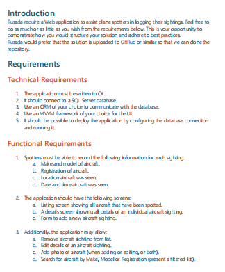

# Aircraft  CRUD App with Asp.Net Core + Angular
# Introduction
The aim of this project is to implement the aircraft CRUD operations requirment as bellow. I implement this application using ASP.NET Web API and Angular



# Running the Application
**Before running this project**
1. Aircraft API Project : Edit appsettings.json -> Connection String as Per Your SQL Server
````
"ConnectionStrings": {
    "DbConnection": "Server=YourPcName; Database=Aircraft sDb; User Id=sa; Password=1234"
  },
````
2. Create SQL Server DB Using the bellow migration code.
````
dotnet ef migrations add AddedDataAnotations -s Aircraft API -p .\Aircraft API.DataAccess

dotnet ef database update -s Aircraft API -p .\Aircraft API.DataAccess
````
3.Aircraft Front Project : Install npm packages using 
````
npm install -g @angular/cli
````
3.To Install other packages(datepicker component & Toster Component)
```` 
ng add ngx-bootstrap --component datepicker

npm i ngx-toastr
npm install ngx - toastr--save
````
5.Aircraft Front Project : Edit below backend URLs as per your  backend URL
aircraftservice.ts and aircraft.component.ts
````
 public createImgPath = (serverPath: string) => {
    return `https://localhost:44391/${serverPath}`;
  }
````
````
 url = 'https://localhost:44391/api/Aircraft s/';
````
